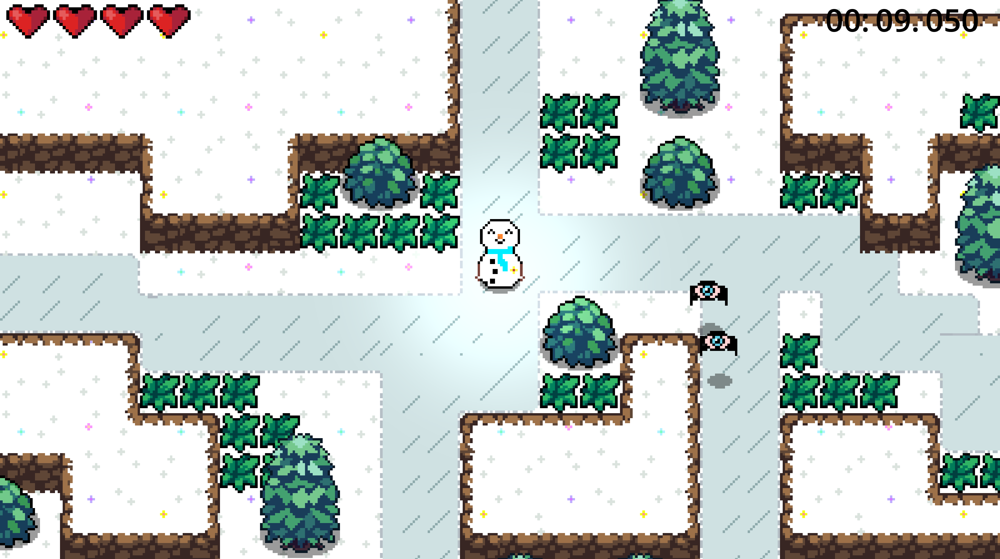
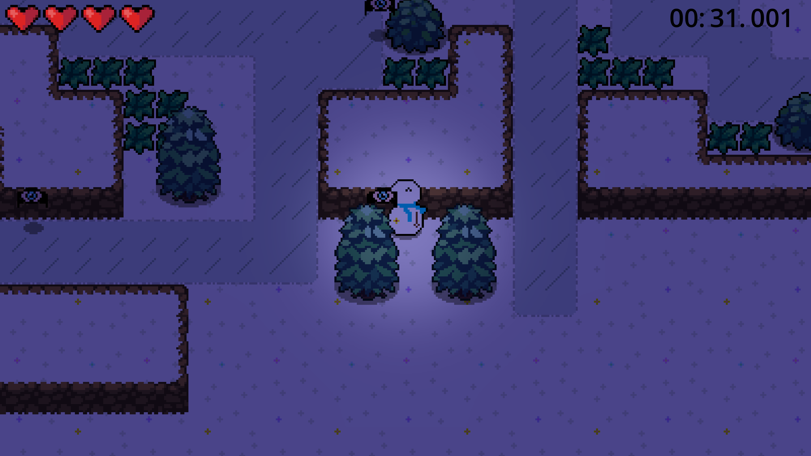

# Snow

Simple 2D topdown game made using Godot game engine. Godot is open source and released under the MIT License so shoutout the creators for making an engine this easy to use while being completely free. This game has one main scene, a player "Snowman" node and one enemy type which is an eyeball that sort of resembles a bat. The bat-eyes appear in a finite set of random locations across a fixed level every time and the goal of the game is to try and defeat them as fast as possible. This is best as a game you play socially with others for 10-15 minutes in person to compete and see who can best optimize the time it takes to take down all the bat-eyes. There are 8 of them in total and so far the best I've done myself is a bit over 11 seconds.

## Programming practices

Godot uses inheritance in a way I didn't expect at first; all children nodes of a scene can be accessed by a script attached to the parent scene as you'd expect. However, communication between scenes is a bit different than communication between classes in Java for example. Importing one scene's functions or variables into another isn't an option, nor is passing a scene into another scene as a parameter. Rather, you use signals to communicate between scenes. A signal is emitted at a location in a script that may be relevant to other scenes; for example, when the Player has no health left we emit a signal in the stats.gd script. This signal can be connected to a function in another script which belongs to another scene, allowing for communication. Right now there are some ways I could definitely be using signals better. The amount of bat-eyes killed by the player and the player's health are currently being stored as global variables. This is fine for what the game is right now but it's not the best possible programming practice for extension. On the other hand, there are other things that've been done well enough in regards to clean architecture; for instance, the script used for the bat-eyes can easily be generalized to other enemies with its idle, wander, and attack states. I could further explore if more abstraction is possible. As I said inheritance isn't standard in Godot but perhaps I can use scenes (functionally) as interfaces and create children from them. An enemy interface would be very useful and I should look into whether I can have scripts inherit from one another like classes in Java.

## Acknowledgments

Huge shoutout to HeartBeast (https://www.youtube.com/@uheartbeast) for making the Godot 2D RPG tutorial because I initially started this game by following his tutorial. The tree, bush, grass and dirt-tileset assets were made by him and some of his other assets are still in my files albeit unused. The assets I created include the Snowman's 60+ frames, the bateye's frames, the snow background, and the ice tilset. This was the first thing I've created with Godot or in video games (besides a Minecraft Mod 8 years ago) and since the foundation for it was laid by HeartBeast I obviously don't intend to profit off this at all. Instead I hope whoever finds this is interested enough to try it out for 10-15 min and have fun.

## Screenshots

